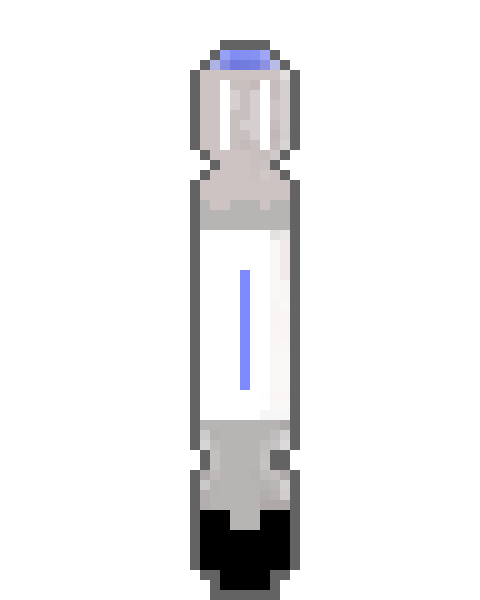

# Doctor who 9th sonic screwdriver multi-tool

This repository is intended as storage for the code and models of my reproduction of the sonic screwdriver, thus it won't have instructions and parts list to build it.

The functions include:
- IR temperature measurement
- Altitude, Pressure and Humidity
- Eletric Screwdriver
- Torch
- Voltmeter